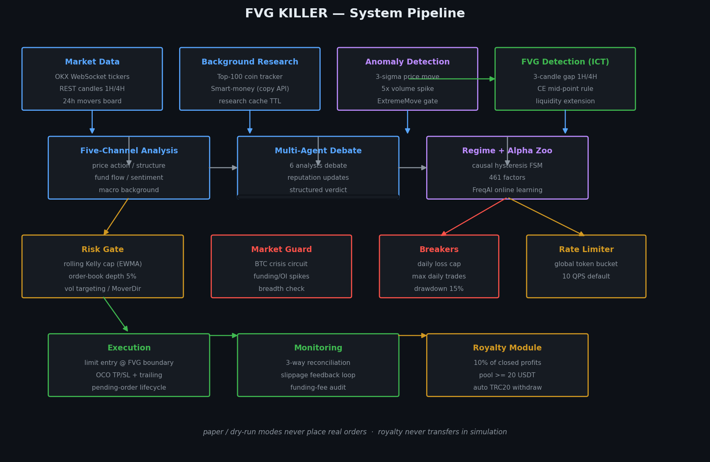
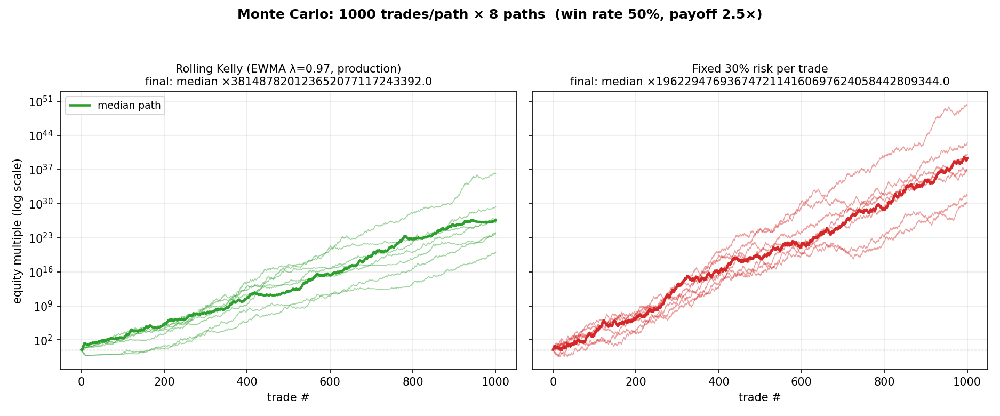

# FVG KILLER（公允价值缺口杀手）v3.3

[English](README.en.md) | **简体中文**

[](docs/USAGE.md#7-测试与验证)
[](requirements.txt)
[](https://www.okx.com)
[](LICENSE)
[](https://github.com/Xbs950812/okx_fvg_agent/discussions)

基于 Fair Value Gap (FVG) 的 OKX 永续合约自动交易机器人，融合 GitHub Top 3 开源项目精华。

> **一句话**：猎杀异常波动后的公允价值缺口 —— 3σ 异常检测 + ICT 三蜡烛缺口 + 五通道研判 + 多 Agent 辩论 + 滚动 Kelly 风险引擎 + 实盘守卫体系，197 项单测 + 蒙特卡洛验证。

## 目录

- [系统架构](#系统架构)
- [核心特性](#核心特性)
- [蒙特卡洛验证](#蒙特卡洛验证--滚动-kelly-vs-固定风险)
- [盈利分成协议 (Royalty)](#盈利分成协议-royalty)（使用前必读）
- [快速开始](#快速开始)
- [运行日志预览](#运行日志预览)
- [配置说明](#配置说明) · [核心模块详解](#核心模块详解) · [常见问题](#常见问题)

## 系统架构



四层管线：**数据/研究层**（WS 行情 + 前 100 名后台追踪 + 3σ 异常 + ICT 缺口检测）→ **研判层**（五通道 + 多 Agent 辩论 + 体制/因子）→ **风控层**（滚动 Kelly + 订单簿深度 + 市场熔断 + 限流）→ **执行层**（FVG 边界限价 + OCO 保护 + 对账 + 分成）。

## 核心特性

| 类别 | 特性 |
|------|------|
| **信号** | 3σ+5x 异常波动检测 · ICT 三蜡烛 FVG（1H/4H）· CE 中点规则 · ATR 缺口分级 |
| **研判** | 五通道分析（价格/结构/资金/情绪/宏观）· 6 分析师多 Agent 辩论 · 因果滞后体制检测 · 461 因子库 · FreqAI 在线学习 |
| **风控** | 滚动分数 Kelly（EWMA λ=0.97，探索→利用双档）· 订单簿深度检查（5%）· 波动率目标仓位 · 方向-涨跌幅门禁 · 日亏/回撤/频次三断路器 |
| **执行** | FVG 边界限价入场 · OCO 保护单（TP 补挂架构）· ATR 动态追踪止损 · 15 分钟挂单超时 · 滑点回填闭环 |
| **运维** | 全局 API 限流令牌桶 · 启动三方对账 · 资金费率对账 · 状态原子持久化 · 无人值守 `--auto` |
| **研究** | 前 100 名全天候追踪 · 聪明钱共识（Copy Trading）· 涨跌幅榜优先队列 · 三时段 HTML 研报 |

**v3.3 新特性（2026-08-14~15）：实盘守卫体系 + 滚动 Kelly 翻倍协议**
- 全局 API 限流令牌桶（主动 QPS 控制，防 429 降权）
- 开仓前订单簿流动性检查（名义仓 / 对侧前 10 档深度 > 5% 拒单，防崩盘薄书滑点）
- 波动率目标仓位（ATR% 缩放保证金，高波动币自动降仓）
- 滚动分数 Kelly 风险上限（<50 笔 1/4 Kelly 探索档 → ≥50 笔 1/2 Kelly 利用档，EWMA 平滑）
- 每日最大交易次数 / 实际滑点回填闭环 / 启动三方对账 / 资金费率实际对账
- 验证资产：169 项单元测试 + 300 路径×1000 笔蒙特卡洛（含边漂移鲁棒性）

**v3.2 新特性：**
- 三挡研判系统（激进/均衡/保守），一键切换交易频率
- 前 100 名合约全天候追踪研究
- 亚洲/欧洲/美国三时段自动生成 HTML 研究报告，支持邮件推送

## 文档索引

| 文档 | 内容 |
|------|------|
| [LICENSE](LICENSE) | 开源协议 — PolyForm Shield 1.0.0 + 作者附加条款（Royalty 盈利分成） |
| [docs/USAGE.md](docs/USAGE.md) | 使用方法 — 安装/配置/运行模式/日志监控/测试 |
| [docs/TROUBLESHOOTING.md](docs/TROUBLESHOOTING.md) | 故障排除 — 网络/限流/挂单/状态文件/常见报错 |
| [docs/UPDATE_MANUAL.md](docs/UPDATE_MANUAL.md) | 更新手册 — v3.3 变更清单/配置迁移/行为变化/回滚 |

## 融合来源

| 项目 | Stars | 核心贡献 |
|------|-------|---------|
| [freqtrade](https://github.com/freqtrade/freqtrade) | 52k⭐ | Hyperopt 参数优化 + Edge 分析 + Trailing Stop + FreqAI 在线学习 + Kelly 仓位 |
| [TradingAgents](https://github.com/TauricResearch/TradingAgents) | 86k⭐ | 多 Agent 辩论引擎 + 分析师信誉 + 决策反思 + 跨品种经验迁移 |
| [Vibe-Trading](https://github.com/vibe-trading/vibe-trading) | 23.6k⭐ | Alpha Zoo 因子库 + 因果滞后体制检测 + 记忆生命周期 |

## 蒙特卡洛验证 — 滚动 Kelly vs 固定风险



1000 笔 × 8 路径（胜率 50%、盈亏比 2.5×）：滚动 Kelly（EWMA λ=0.97，生产配置）与固定 30% 风险的对比。同一随机序列配对设计，图形与 `verify_kelly_monte_carlo.py` 验证数字同源。

**完整验证结论**（300 路径 × 1000 笔，含边漂移鲁棒性，详见 [更新手册](docs/UPDATE_MANUAL.md)）：

| 场景 | 滚动 Kelly | 固定 30% 风险 |
|------|-----------|--------------|
| 边稳定（p=0.5, b=2.5） | 增长略慢 ~20%（回撤浅 15~20pp 的代价） | 增长更快 |
| 边衰减（p 0.5→0.4） | 中位回撤 **83.1%** | 中位回撤 **100%**（湮灭） |
| 边消失（p 0.5→0.25） | **+27 次翻倍存活** | 2⁻²¹ 湮灭 |
| 第 50 笔档位跳变（1/4→1/2 Kelly） | maxDD 差 **0.0%**（统计不可见） | — |

边漂移场景复现：`python verify_kelly_monte_carlo.py --drift 0.5 0.4`

## 策略概述

1. **异常检测** — 识别 >=3sigma 价格波动 + 5x 成交量放大的蜡烛
2. **FVG 识别** — 标准 ICT 三蜡烛缺口检测（1H / 4H）
3. **前 100 名追踪** — 后台线程全天候研究前 100 名合约，实时更新缓存
4. **五通道分析** — 价格行为 + 市场结构 + 资金流向 + 市场情绪 + 宏观背景
5. **多 Agent 辩论** — 6 位分析师独立研判 + 结构化辩论 + 综合研判
6. **体制检测** — 因果滞后状态机，避免噪音导致的频繁切换
7. **Alpha 因子** — 12 个内置因子，支持因子发现、组合、回测
8. **FreqAI 预测** — 在线学习流水线，预测信号质量
9. **三挡研判** — 激进/均衡/保守一键切换，激进模式强制建仓 + 用户确认
10. **限价入场** — 挂单在 FVG 边界内，避免流动性扫荡
11. **TP 50% FVG** — 止盈 FVG 缺口 50% 宽度
12. **SL 边界外** — 止损在 FVG 边界外侧 15% 缓冲
13. **Trailing Stop** — 到达 50% 盈利后激活追踪止损
14. **Kelly 仓位** — 基于历史交易计算最优仓位
15. **Hyperopt 优化** — 定期参数优化 + Walk-Forward 验证 + 敏感性分析
16. **自适应调参** — 连亏自动降杠杆/暂停，回撤过大自动熔断
17. **定时报告** — 亚洲/欧洲/美国开盘时自动生成 HTML 研究报告 + 邮件推送
18. **钱包翻倍提现** — 每次翻倍提取 25% 落袋为安
19. **盈利分成 (Royalty)** — 每笔盈利的 10% 自动累积至阈值后链上提现至作者钱包（开源分成协议，详见下文）

## 盈利分成协议 (Royalty)

本项目采用 **"盈利才付费"** 的开源分成模式：机器人每笔**已实现盈利**平仓后，自动按 `10%` 计入分成池；累积到 20 USDT 后自动经 USDT-TRC20 链上提现至作者钱包。

```
你的盈利 +100 USDT → 分成池 +10 USDT → 池满 20 USDT → 自动提现 (TRC20, 手续费约 1 USDT)
你的亏损            → 不收取任何分成
```

**协议条款**：本软件采用 **PolyForm Shield 1.0.0 + 作者附加条款（Royalty Provision）** 授权，详见根目录 [LICENSE](LICENSE)。要点：任何用途（含实盘盈利）均可免费使用，唯一条件是**保留盈利分成功能与默认收款地址**；禁止将本软件改造成与作者竞争的产品；移除/关闭分成需商业授权。

**关键行为**：
- 只对盈利收取，亏损/保本不计入
- paper/dry_run 模拟模式只记日志，绝不真实转账
- 提现前自动做 trading→funding 资金划转，金额保守（池减手续费），不会因余额不足失败
- **自动提现需要你的 API key 开启提现权限并添加收款地址白名单**（OKX 后台操作）；未开启时程序降级为小时级重试 + 日志提醒，不影响任何交易功能
- 分成状态持久化在 `royalty_state.json`，重启不丢失

**匿名使用统计（遥测）**：为让作者知道部署量与分成池状态，机器人每 24 小时发送一条匿名心跳（首次启动即发一条），提现/权限事件即时上报。上报仅 8 个公开字段：匿名安装 ID（首次随机生成的 12 位 hex）、版本、事件类型、是否纸面模式、池余额、累计分成、提现次数、时间戳——**不含 API 密钥、钱包、持仓或任何个人信息**。接收端点代码就在仓库里（[deploy/royalty_report_worker.js](deploy/royalty_report_worker.js)，Cloudflare Worker + KV 免费版），收集了什么、丢弃了什么任何人可审计。关闭统计与关闭分成同属商业授权范围。

**配置**（`config.json` 的 `royalty` 段）：

| 参数 | 默认值 | 说明 |
|------|--------|------|
| `enabled` | `true` | 分成开关（关闭需商业授权） |
| `wallet_address` | 内置默认 | 收款钱包（T 开头 34 位 TRC20 地址） |
| `rate_pct` | `10.0` | 分成比例（盈利的百分比） |
| `min_withdraw_usdt` | `20.0` | 分成池累积阈值，达到后自动提现 |
| `check_interval_s` | `300` | 提现失败后的最小重试间隔（秒） |

### 如何合规使用（分成条款触发条件）

**开箱即用 = 自动合规。** 默认配置（`config.example.json` 原样复制）已满足 LICENSE 全部条件，你无需做任何额外操作。合规条件与扣钱时机是两回事，分别如下：

**一、授权合规条件**（对应 [LICENSE](LICENSE) 附加条款 §1，四条须同时满足）：

| # | 条件 | 默认值是否满足 |
|---|------|---------------|
| 1 | `royalty.enabled` 保持 `true` | 是 |
| 2 | 收款钱包保持 `royalty.py` 内置的 `DEFAULT_ROYALTY_WALLET`（不删除、不在 config 中覆盖为其他地址） | 是 |
| 3 | `royalty.rate_pct` 不低于 `10.0` | 是 |
| 4 | 匿名统计保持开启（`royalty.report_enabled=true`，仅 8 个公开字段，见上文遥测章节） | 是 |

**二、实际扣钱（分成记账）的触发条件**——只有同时满足以下情形才会产生分成：

- 实盘模式（paper 纸面 / dry_run 演练**永不**真实转账）
- 持仓**平仓后**已实现盈亏为**正**（浮盈不算、亏损/保本不计）
- 金额 = 该笔盈利 × `rate_pct`，记入分成池；池累积到 20 USDT 才发起一笔链上提现（小额盈利只是记账，不会频繁转账）

**三、以下情况不构成违约**（对应 LICENSE 附加条款 §2）：

- OKX API key 未开启提现权限、或收款地址未加提现白名单 → 自动提现无法执行时，程序只记账并日志提醒；只要你未修改代码与配置中的分成功能，即视为合规
- 只跑纸面/回测/研究，从未实盘 → 没有已实现盈利，分成池为零，同样合规

**四、需要商业授权的情况**（对应 LICENSE 附加条款 §3）——下列任一改动会使免费授权失效：

- 删除或禁用 `royalty` 分成模块（`enabled=false`、删除 `royalty.py` 调用等）
- 将收款钱包改为其他地址
- 将 `rate_pct` 降到 10 以下

以上情况请联系作者获取商业授权：https://github.com/Xbs950812

**一句话总结**：不改分成配置怎么用都免费（含实盘赚钱）；动了分成配置就需要商业授权。

## 项目结构

```
okx_fvg_agent/
├── agent.py            # 主循环入口 (v3.3)
├── strategy.py         # FVG 检测 + 异常波动 + 信号生成
├── executor.py         # 仓位计算 + 下单 + 订单簿流动性检查 + 持仓监控
├── okx_client.py       # OKX API v5 客户端 (代理/模拟盘/限流令牌桶)
├── paper_trading.py    # 纸面交易引擎 (限价回补成交/爆仓封顶/滑点语义)
├── multi_channel.py    # 五通道信息分析 + 超级交易专家引擎
├── optimization.py     # Edge 分析 + 自适应调参 + Trailing Stop
├── memory.py           # 决策日志 + 反思引擎 + 体制记忆
├── debate_engine.py    # TradingAgents 多 Agent 辩论引擎
├── hyperopt.py         # freqtrade 参数优化 + Kelly + 滚动Kelly(EWMA) + FreqAI
├── alpha_zoo.py        # Vibe-Trading Alpha 因子库 + 体制检测 + 记忆生命周期
├── coin_tracker.py     # 后台币种追踪研究（前 100 名合约）
├── royalty.py          # 盈利分成模块 (盈利 10% 计池 → 阈值自动 TRC20 提现)
├── report.py           # 定时 HTML 研究报告生成 + SMTP 邮件发送
├── config.example.json # 配置模板 (复制为 config.json 并填入密钥)
├── start_agent.bat     # Windows 一键启动
├── requirements.txt    # Python 依赖
├── LICENSE             # PolyForm Shield 1.0.0 + Royalty 附加条款
├── docs/               # 使用方法 / 故障排除 / 更新手册
├── test_*.py           # 单元测试 (197 项)
├── verify_*.py         # 蒙特卡洛/档位切换验证脚本
├── reports/            # 研究报告输出目录
└── README.md           # 本文件
```

## 快速开始

### 1. 安装依赖

```bash
pip install -r requirements.txt
```

### 2. 配置 API 密钥

编辑 `config.json`，填入你的 OKX API 凭证：

```json
{
  "okx": {
    "api_key": "你的API_KEY",
    "api_secret": "你的API_SECRET",
    "passphrase": "你的PASSPHRASE",
    "base_url": "https://www.okx.com",
    "proxy": ""
  }
}
```

> API 权限要求：交易（Trade）+ 读取（Read），建议绑定 IP 白名单。
> 国内用户如需代理，填写 `proxy` 字段：`"proxy": "http://127.0.0.1:7890"`

### 3. 模拟交易（可选）

在 OKX App → 模拟交易 → API 创建模拟盘 API 密钥，然后修改 `config.json`：

```json
{
  "okx": {
    "demo": true,
    "demo_api_key": "模拟盘API_KEY",
    "demo_api_secret": "模拟盘API_SECRET",
    "demo_passphrase": "模拟盘PASSPHRASE"
  }
}
```

### 4. 纸面模式（推荐先测试）

`config.json` 中同时打开 `agent.dry_run=true` 和 `paper.enabled=true`，虚拟余额 + 实时行情模拟完整交易生命周期（限价回补成交/止盈止损/爆仓封顶），绝不下真实单：

```json
{
  "agent": { "dry_run": true },
  "paper": { "enabled": true, "balance": 30.0 }
}
```

```bash
python agent.py
```

纯演练模式（只输出信号日志、不模拟持仓）：`python agent.py --演练 --单轮`

### 5. 实盘运行

```bash
python agent.py
```

> 切实盘前必读 [docs/UPDATE_MANUAL.md](docs/UPDATE_MANUAL.md) — 实盘模式下限流令牌桶、订单簿流动性检查、启动三方对账会自动生效。

### 6. 切换挡位

编辑 `config.json`，修改 `agent.aggressiveness`：

```json
// 激进模式：每天必找一个币建仓
"aggressiveness": 1

// 均衡模式：2-3天一操作
"aggressiveness": 2

// 保守模式：严格门禁（默认）
"aggressiveness": 3
```

## 运行日志预览

真实生产日志摘录（2026-08-14 实盘守卫生效时）——机器人 99% 的时间在**说不**，五道门禁逐一否决不合格信号：

```text
──────────────────────────────────────────────────
  ROUND 8  2026-08-14 09:28 UTC
──────────────────────────────────────────────────
[Freshness] SNXX-USDT-SWAP 1H FVG 距最新 K 线 186 根 > 24，已过期，丢弃信号
[ATRGrade]  SNXX-USDT-SWAP 1H FVG 宽度 0.16 / ATR 0.37 = 0.43 < 0.5，C级弱缺口负期望，丢弃信号
[MoverDir]  ETHFI-USDT-SWAP 4H long 被方向门禁否决: 涨幅榜币 24h +14.4% 暴涨，禁追多
[DepthGate] EDEN-USDT-SWAP long 挂单价偏离现价 6.06% > 5.0% 方向矛盾(做多等深跌=接飞刀)，回退 FVG 回补位
[DepthGate] LAB-USDT-SWAP short FVG 回补位仍偏离 11.32% > 5.0%，方向矛盾否决信号
```

每道门禁的取舍逻辑见 [docs/USAGE.md](docs/USAGE.md#6-日志监控关键字)；全部通过后的开仓/保护单/平仓确认日志关键字亦有文档化。

## 命令行参数

| 参数 | 短参 | 说明 |
|------|------|------|
| `--配置文件`, `-c` | `-c` | 配置文件路径（默认 `config.json`） |
| `--演练`, `-d` | `-d` | 演练模式，不实际下单 |
| `--单轮`, `-o` | `-o` | 只运行一轮后退出 |
| `--日志级别` | — | 日志级别：DEBUG/INFO/WARNING/ERROR |
| `--轮次`, `-r` | `-r` | 最大运行轮次，0 表示无限制 |
| `--扫描间隔` | — | 扫描间隔秒数，覆盖配置文件 |
| `--币种上限` | — | 扫描币种数量上限，覆盖配置文件 |

示例：

```bash
# 演练模式，只跑一轮
python agent.py --演练 --单轮

# 演练模式，跑 10 轮
python agent.py --演练 --轮次 10

# 指定配置文件
python agent.py --配置文件 my_config.json
```

## 配置说明

### 策略参数 (`strategy`)

| 参数 | 默认值 | 说明 |
|------|--------|------|
| `timeframes` | `["1H", "4H"]` | 扫描的时间周期 |
| `min_fvg_width_pct` | `{"1H": 1.5, "4H": 3.0}` | 最小 FVG 宽度 |
| `fvg_target_pct` | `0.50` | 止盈目标（FVG 宽度的 50%） |
| `stop_buffer_pct` | `0.15` | 止损缓冲（FVG 边界外侧 15%） |
| `entry_depth_pct` | `0.15` | 入场深度（进入 FVG 15%） |
| `abnormal_sigma` | `3.0` | 异常波动 sigma 阈值 |
| `abnormal_volume_ratio` | `5.0` | 异常量比阈值 |
| `min_volume_24h_usd` | `5,000,000` | 最小 24h 成交量 |
| `max_spread_pct` | `0.5` | 最大允许买卖价差 |
| `max_funding_rate_abs` | `0.01` | 最大允许资金费率 |

### 多通道分析 (`multi_channel`)

| 参数 | 默认值 | 说明 |
|------|--------|------|
| `enabled` | `true` | 启用多通道分析 |
| `channel_weights` | 见配置 | 五通道权重 |
| `min_confidence` | `0.40` | 最低综合分析置信度 |
| `min_agreement` | `0.50` | 最低通道一致性 |

### 辩论引擎 (`debate_engine`) — TradingAgents 86k⭐

| 参数 | 默认值 | 说明 |
|------|--------|------|
| `enabled` | `true` | 启用多 Agent 辩论 |
| `debate_rounds` | `2` | 辩论轮次 |
| `min_agreement` | `0.50` | 最低分析师一致性 |
| `save_checkpoints` | `true` | 保存辩论检查点 |

### Alpha 因子库 (`alpha_zoo`) — Vibe-Trading 23.6k⭐

| 参数 | 默认值 | 说明 |
|------|--------|------|
| `enabled` | `true` | 启用 Alpha 因子分析 |
| `min_factor_score` | `40` | 最低因子评分 |
| `hysteresis_threshold` | `0.15` | 体制切换滞后阈值 |
| `min_regime_duration` | `5` | 最短体制持续时间 |

### FreqAI (`freqai`) — freqtrade 52k⭐

| 参数 | 默认值 | 说明 |
|------|--------|------|
| `enabled` | `true` | 启用在线学习 |
| `feature_window` | `50` | 特征窗口大小 |
| `retrain_interval` | `10` | 重训练间隔（笔） |
| `min_prediction_confidence` | `-0.5` | 最低预测置信度 |

### Hyperopt (`hyperopt`) — freqtrade 52k⭐

| 参数 | 默认值 | 说明 |
|------|--------|------|
| `enabled` | `true` | 启用参数优化 |
| `optimize_interval_rounds` | `50` | 优化间隔（轮） |
| `n_initial` | `5` | 初始网格点数 |
| `n_refine` | `3` | 细化轮次 |

优化器包含：Bayesian 网格搜索 → 自适应细化 → Walk-Forward 滚动窗口验证 → OOS 过拟合检测 → 参数敏感性分析 → 综合性能仪表盘（Sharpe/Sortino/Calmar）

### 风控参数 (`risk`)

| 参数 | 默认值 | 说明 |
|------|--------|------|
| `risk_per_trade_pct` | `30.0` | 单笔风险上限（以损定量上限，满倍率模式下与保证金比例对齐） |
| `max_leverage` | `10` | 最大杠杆倍数 |
| `max_position_leverage` | `0` | 单笔杠杆封顶（0=不封顶，执行杠杆=币种最大杠杆） |
| `margin_mode` | `isolated` | 逐仓模式 |
| `margin_pct` | `30` | 最大保证金比例（30%） |
| `profit_withdrawal_pct` | `25` | 翻倍后提现比例（25%） |
| `max_positions` | `1` | 最大同时持仓数 |
| `max_daily_loss_pct` | `10` | 每日最大亏损比例 |
| `max_daily_trades` | `0` | 每日最大平仓笔数（0=不限制，实盘建议 6~10） |
| `rolling_kelly` | 见模板 | 滚动分数 Kelly 风险上限（探索→利用，EWMA 平滑） |
| `order_book_depth` | 见模板 | 订单簿流动性检查（5% 阈值，仅实盘路径） |
| `vol_targeting` | 见模板 | 波动率目标仓位（ATR% 缩放保证金） |

### 限流与对账 (`okx.rate_limit` / `agent.reconciliation`)

| 参数 | 默认值 | 说明 |
|------|--------|------|
| `okx.rate_limit.max_qps` | `10` | 全局令牌桶 QPS（实盘生效，纸面自动关闭） |
| `okx.rate_limit.burst_capacity` | `20` | 突发容量 |
| `agent.reconciliation.startup_enabled` | `true` | 启动三方对账（持仓↔本地状态↔保护单） |
| `agent.reconciliation.funding_fee_interval_rounds` | `6` | 资金费率实际对账间隔（轮） |

### 自适应调参 (`optimization`)

| 参数 | 默认值 | 说明 |
|------|--------|------|
| `enabled` | `true` | 启用自适应调参 |
| `adaptive_enabled` | `true` | 启用动态参数调整 |
| `trailing_stop_enabled` | `true` | 启用追踪止损 |
| `trailing_stop_activation_pct` | `0.50` | 追踪止损激活阈值（达到止盈 50%） |
| `trailing_stop_trail_pct` | `0.30` | 追踪距离（30%） |

### Agent 参数 (`agent`)

| 参数 | 默认值 | 说明 |
|------|--------|------|
| `scan_interval_seconds` | `300` | 扫描间隔（5 分钟） |
| `coin_scan_limit` | `100` | 每轮扫描合约数上限 |
| `dry_run` | `false` | 模拟模式开关 |
| `log_level` | `INFO` | 日志级别 |
| `log_file` | `agent.log` | 日志文件路径 |
| `aggressiveness` | `3` | 研判挡位: 1=激进, 2=均衡, 3=保守 |

### 研判挡位说明 (`aggressiveness`)

| 挡位 | 名称 | 策略 | 适用场景 |
|------|------|------|---------|
| **1** | 激进 | 每天必须找到一个币种建仓，大幅降低阈值，无可选信号时强制选最优 | 追求高频交易，接受较高风险 |
| **2** | 均衡 | 适中阈值，2-3 天操作一笔 | 平衡风险与频次 |
| **3** | 保守 | 严格门禁，高置信度才出手（默认） | 追求高胜率，低频交易 |

挡位 1 激进模式的具体行为：
- 降低 FVG 最小宽度、异常波动阈值、置信度/一致性要求
- 关闭 FreqAI 预测过滤（阈值设为 -2.0）
- 如果一轮扫描后没有任何币种通过门槛，自动选择置信度最高的币种强制建仓
- 强制建仓时使用 3x 杠杆（低于 max_leverage），5% 止损 / 5% 止盈

### 币种追踪 (`coin_tracker`)

后台线程持续追踪 **前 100 名** 合约，实时拉取 K 线、计算 FVG 信号、多通道分析、体制检测，结果存入缓存供主循环直接取用。

| 参数 | 默认值 | 说明 |
|------|--------|------|
| `warmup_top_n` | `100` | 启动时预热的币种数 |
| `max_cache_entries` | `500` | 缓存最大条目数 |
| `research_ttl_seconds` | `300` | 研究结果有效期（5分钟） |
| `research_batch_size` | `8` | 每批研究币种数 |

### 定时研究报告 (`report`)

在亚洲开盘（08:00）、欧洲开盘（15:00）、美国开盘（20:00）三个时段自动生成 Top 30 币种综合研判报告，保存为 HTML 文件到 `reports/` 目录，并可配置发送到指定邮箱。

| 参数 | 默认值 | 说明 |
|------|--------|------|
| `report.enabled` | `true` | 启用定时报告 |
| `report.top_n_display` | `30` | 报告中展示的币种数 |
| `report.session_times` | `["08:00","15:00","20:00"]` | 触发时段（北京时间） |
| `report.email.enabled` | `false` | 启用邮件发送 |
| `report.email.smtp_host` | `smtp.qq.com` | SMTP 服务器 |
| `report.email.sender` | — | 发件人邮箱 |
| `report.email.password` | — | SMTP 授权码 |
| `report.email.recipients` | — | 收件人列表 |

邮件配置示例（QQ邮箱）：

```json
"report": {
  "email": {
    "enabled": true,
    "smtp_host": "smtp.qq.com",
    "smtp_port": 465,
    "smtp_ssl": true,
    "sender": "123456789@qq.com",
    "password": "你的QQ邮箱授权码",
    "recipients": ["123456789@qq.com"]
  }
}
```

## 核心模块详解

### 辩论引擎 (`debate_engine.py`)

模拟 TradingAgents 的多 Agent 辩论流程：

1. **分析师独立研判** — 6 位分析师（技术/结构/资金流/情绪/宏观/风控）基于各自专长独立研判
2. **结构化辩论** — 多轮交叉辩论，正反双方质询
3. **综合研判** — 加权综合所有分析师意见 + 辩论结果
4. **分析师信誉** — 贝叶斯平滑更新，正确预测加分，错误减分
5. **Checkpoint** — 辩论状态持久化，支持中断恢复
6. **决策注入** — 历史反思注入未来研判

### 参数优化 (`hyperopt.py`)

借鉴 freqtrade 的完整优化框架：

1. **BayesianHyperopt** — 粗粒度网格搜索 + 自适应细化
2. **Walk-Forward** — 滚动窗口优化 + OOS 验证
3. **Kelly Criterion** — 最优仓位计算
4. **FreqAIPipeline** — 在线学习流水线
5. **Sensitivity** — 参数敏感性分析
6. **Dashboard** — 综合性能仪表盘

### Alpha 因子库 (`alpha_zoo.py`)

借鉴 Vibe-Trading 的因子管理框架：

1. **AlphaZoo** — 因子注册表，12 个内置因子
2. **FactorOperator** — 算术/比较/逻辑/变换运算符
3. **FactorBacktest** — IC 分析 + 分位数收益 + 因子衰减
4. **CausalHysteresisRegime** — 因果滞后状态机
5. **EnhancedMemoryLifecycle** — 三层记忆存储 + Ebbinghaus 衰减
6. **FactorAnalyzer** — 统计显著性检验 + VIF 多重共线性检测 + 子样本稳健性 + 边际贡献分析

### 币种追踪 (`coin_tracker.py`)

后台线程持续研究前 100 名合约：

1. **CoinResearchCache** — 线程安全缓存，TTL 过期 + LRU 淘汰，最大 500 条
2. **CoinTracker** — 后台守护线程，轮询拉取 K 线、计算 FVG、多通道分析、体制检测
3. **批量研究** — 每批 8 个币种，批次间冷却 1.5 秒，避免 API 限流
4. **预热机制** — 启动时快速研究 Top 100 币种，确保首轮扫描有缓存可用
5. **pause/resume** — 主循环执行时暂停追踪，避免 API 冲突

### 定时报告 (`report.py`)

时段转换时自动生成 + 发送研究报告：

1. **SessionReporter** — 时段检测，防止同分钟重复触发
2. **HTML 报告** — 深色主题，含概览卡片、Top 30 排序表、Top 10 通道详情
3. **SMTP 邮件** — 支持 SSL 加密发送（QQ邮箱/Gmail/163 等）
4. **本地存档** — 报告保存到 `reports/` 目录，文件名含日期时段
5. **三时段触发** — 北京时间 08:00（亚洲开盘）、15:00（欧洲开盘）、20:00（美国开盘）

### 优化引擎 (`optimization.py`)

借鉴 freqtrade 的完整优化与风控框架：

1. **EdgeAnalyzer** — 分方向/体制/评分分桶统计：胜率、盈亏比、期望值、最大回撤、连亏次数
2. **AdaptiveParameterTuner** — 自适应参数调整：连亏 ≥3 自动降杠杆，连亏 ≥5 暂停交易，回撤 >20% 暂停，稳定盈利可提杠杆
3. **TrailingStop** — 追踪止损：达到止盈 50% 激活，追踪距离 30%，动态上移不回落
4. **PortfolioRisk** — 组合风控：VaR 估算、综合风险评分 (0-100)、保证金使用率监控、最大回撤预警

### 记忆与反思 (`memory.py`)

完整的决策记忆与经验提炼系统：

1. **DecisionLog** — 每笔交易完整记录 + 入场快照（价格、信号、通道分析、辩论结果）
2. **MemoryManager** — 决策日志 JSONL 持久化、体制记忆、经验教训、反思报告 Markdown
3. **反思引擎** — 盈利/亏损归因分析、红旗预警、经验提炼、参数调整建议
4. **跨品种经验迁移** — 同体制下参考其他品种历史表现，贝叶斯加权综合
5. **记忆生命周期** — Ebbinghaus 遗忘曲线衰减、质量评分、自动归档修剪

### 执行模块 (`executor.py`)

订单执行与持仓管理：

1. **仓位计算** — 基于风险金额和止损距离的精确仓位计算（见下方公式）
2. **订单执行** — 先设杠杆 → 下限价单 → 附带止盈止损（attachAlgoOrds）
3. **挂单管理** — 自动检测并取消过期/价格偏离过大的挂单，防止重复下单
4. **持仓监控** — 实时盈亏追踪、每日亏损累加、胜率统计、Trailing Stop 触发
5. **状态持久化** — `agent_state.json` 保存初始权益、累计盈亏、提现记录、每日亏损

## 仓位计算公式

```
risk_amount   = equity x risk_per_trade_pct
stop_dist_pct = |entry - stop_loss| / entry
position_val  = risk_amount / stop_dist_pct
margin        = position_val / leverage
sz            = position_val / (price x contract_value)
```

## 状态持久化

运行状态保存在 `agent_state.json`，包含：
- 初始权益、最高权益
- 累计盈亏、胜率统计
- 提现次数、上次提现权益
- 每日亏损追踪

## 风险提示

- 本策略基于历史价格模式，不保证未来收益
- 建议先用小额资金测试，确认策略逻辑符合预期
- 高杠杆交易可能导致本金全部亏损
- 请确保理解每一行代码后再实盘运行

## 安全警告

- **API 密钥明文存储**：`config.json` 中的 API 密钥为明文，请勿将配置文件提交到公开仓库或分享给他人。建议在 OKX 后台绑定 IP 白名单
- **模拟盘先行**：首次使用务必在 `config.json` 中设置 `demo: true`，用模拟盘 API 密钥测试，确认无误后再切换实盘
- **权限最小化**：API 密钥仅需 Trade + Read 权限即可运行全部交易功能。**例外**：启用盈利分成自动提现（默认开启）需额外开启 Withdraw 权限并添加收款地址白名单；不开权限时分成仅记账并日志提醒，绝不影响交易
- **日志敏感信息**：`agent.log` 可能包含账户余额、持仓等敏感数据，请妥善保管

## 日志管理

- 日志文件 `agent.log` 随运行时间增长，建议定期清理或配置日志轮转
- 日志级别可在 `config.json` 中设置（DEBUG/INFO/WARNING/ERROR），生产环境建议使用 INFO
- 减少第三方库噪音：`urllib3`、`requests`、`httpx` 等第三方库日志已被自动静音

## 常见问题

### 网络连接失败

```bash
# 确认代理配置正确（国内用户）
# 在 config.json 中设置:
"proxy": "http://127.0.0.1:7890"

# 或测试直连:
ping www.okx.com
```

### 模拟盘 API 报错

确认 `config.json` 中 `demo: true` 且使用了模拟盘的 API 密钥（在 OKX App → 模拟交易 → API 中创建）。模拟盘与实盘 API 密钥不通用。

### 依赖安装失败

```bash
# 确保在项目目录下执行
cd d:\123\okx_fvg_agent
pip install -r requirements.txt

# 如果 python-okx 安装失败，尝试单独安装
pip install python-okx>=0.4.0
```

### 首轮扫描无信号

- 检查挡位设置：激进模式（挡位 1）会大幅降低阈值，保守模式（挡位 3）可能长时间无信号
- 观察 CoinTracker 预热状态：启动日志中会显示预热完成的币种数
- 检查 `min_volume_24h_usd` 是否过滤掉了所有币种

### agent.log 过大

```bash
# 安全清理（保留最近 1000 行）
powershell -Command "Get-Content agent.log -Tail 1000 | Set-Content agent.log -Encoding UTF8"
```